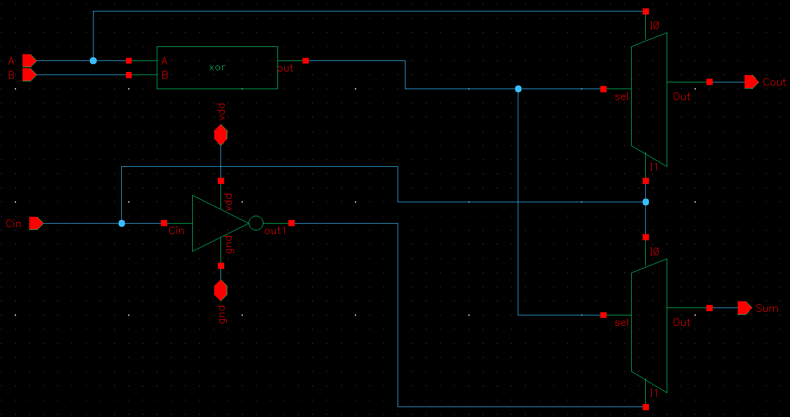
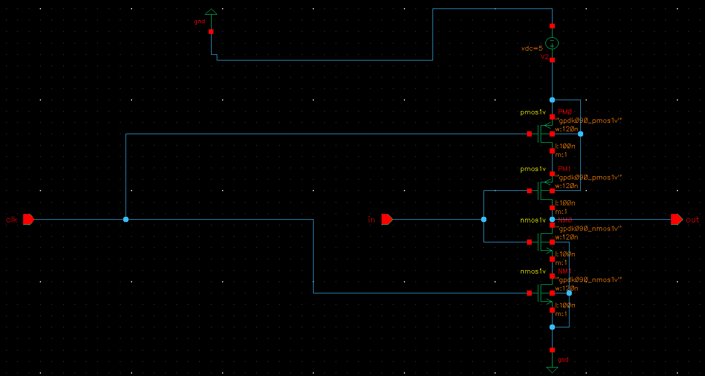
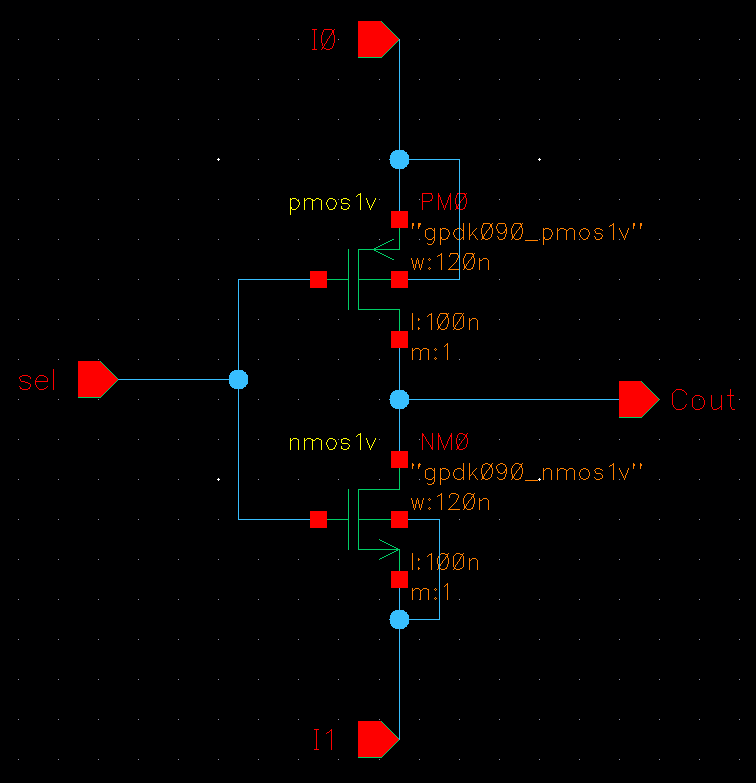
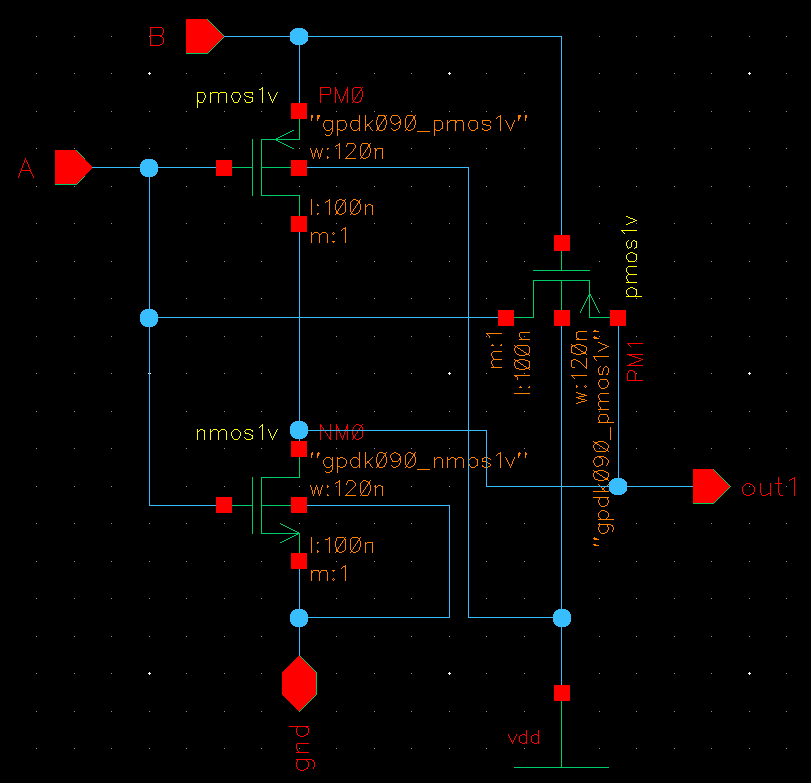
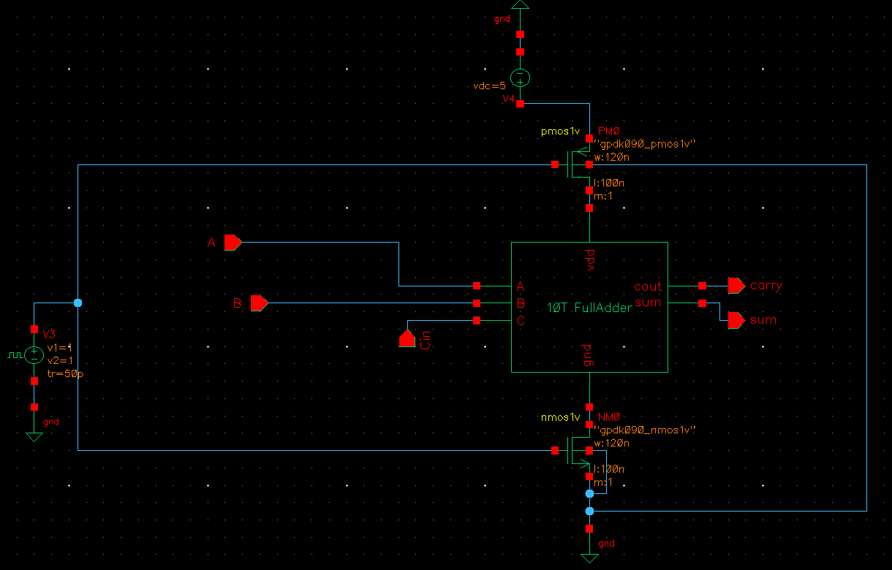
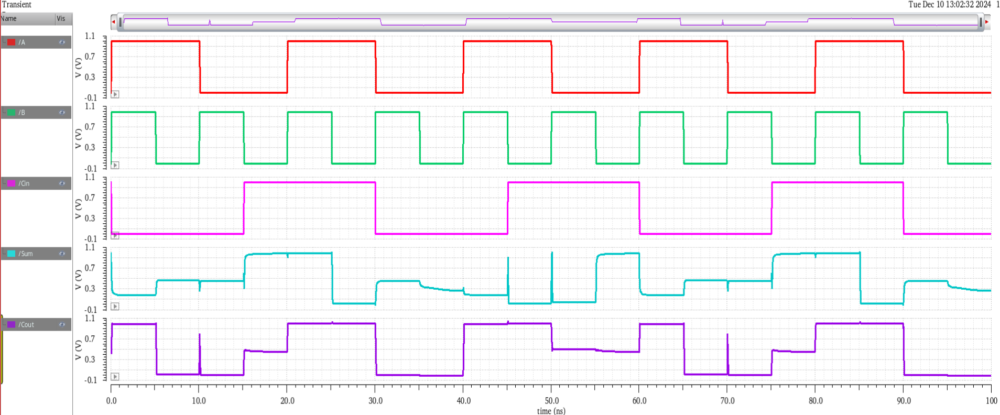

# MTCMOS-Based 10-Transistor Full Adder Design

This project presents the **design and simulation** of a **low-power Full Adder** circuit using the **MTCMOS (Multi-Threshold CMOS)** technique in **Cadence Virtuoso**.

We have successfully reduced:
- ✅ Transistor Count
- ✅ Power Consumption
- ✅ Propagation Delay

This was achieved by using a **10-transistor architecture**, with logic constructed from minimal modules like **Inverter**, **MUX**, and **XOR**.

## 💡 MTCMOS Technique – Overview

**MTCMOS (Multi-Threshold CMOS)** is a power optimization technique used in VLSI circuits.

### 🔍 Key Concepts:
- Uses **two types of transistors**:
  - **Low-Vt** (low threshold voltage): Fast switching but higher leakage
  - **High-Vt**: Lower leakage but slower switching
- Logic gates are built using **low-Vt transistors**
- **High-Vt sleep transistors** are used to **cut off leakage paths** during idle mode

### ✅ Benefits of MTCMOS:
- Greatly **reduces subthreshold leakage current**
- Preserves **performance during active mode**
- Ideal for **low-power, high-speed** VLSI designs

## 🔧 Circuit Modules Used

### 1️⃣ Inverter
- Basic NOT gate using minimal transistors (2 or fewer)
- Used in XOR and MUX designs for signal inversion

### 2️⃣ XOR Gate
- Essential for generating the SUM output of the full adder
- Designed using an optimized transistor configuration

### 3️⃣ 2:1 Multiplexer (MUX)
- Used to select between pre-evaluated logic paths
- Saves transistor count by avoiding large logic trees

### 4️⃣ Full Adder (10T)
- Final design integrates above modules
- Uses only 10 transistors (compared to 28T in traditional designs)
- Implemented with MTCMOS sleep transistors to reduce leakage

## 🖼️ Schematic Snapshots
### 🔧 Full Adder Circuit

### 🔧 Inverter Circuit

### 🔧 Mux Circuit

### 🔧 Xor Circuit

### 🔧 MTCMOS Full Adder Circuit

### 📈 Simulation Output

## 📊 Performance Results

| Parameter           | Value       |
|---------------------|-------------|
| Transistor Count    | 10          |
| Power Consumption   | 2.85 µW     |
| Propagation Delay   | 95 ps       |
| Technology Node     | 90nm        |
| Tool Used           | Cadence Virtuoso + Spectre |
